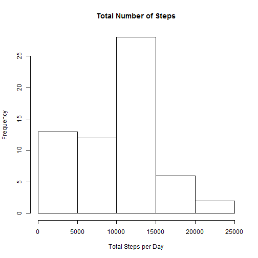
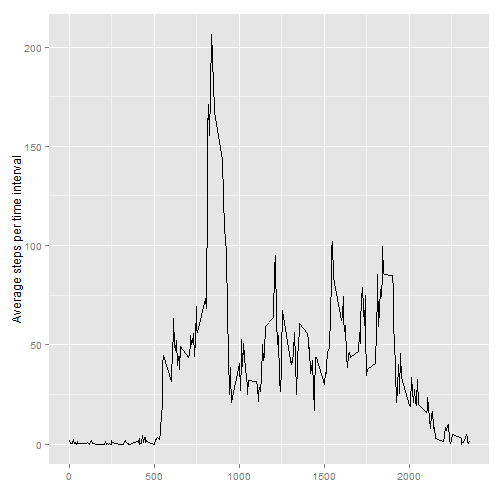
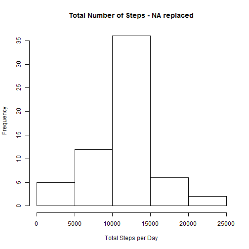
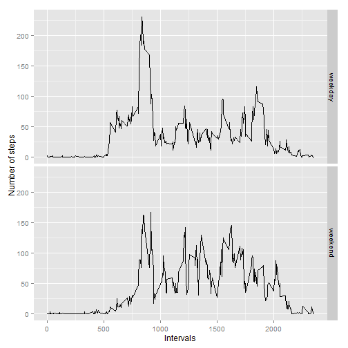

This is Assignment 1 for the Reproducible Research Course.

This assignment makes use of data from a personal activity monitoring device. This device collects data at 5 minute intervals through out the day. The data consists of two months of data from an anonymous individual collected during the months of October and November, 2012 and include the number of steps taken in 5 minute intervals each day.

The data for this assignment can be downloaded from the course web site:
Dataset: [Activity monitoring data] (https://d396qusza40orc.cloudfront.net/repdata%2Fdata%2Factivity.zip)

The process reads the data.

```r
# set the working directory
setwd ("C:/Users/user/repro1/RepData_PeerAssessment1")

unzip(zipfile="./activity.zip",exdir=".",)

##Activity <- read.csv("activity.csv",stringsAsFactors = FALSE)

Activity <- read.csv("activity.csv")

# calculate total steps by day

library(plyr)
```

```
## Warning: package 'plyr' was built under R version 3.1.3
```

```r
#arrange(Activity, asc(date))

StepsDays<-ddply(Activity,.(date),summarize,TotalSteps=sum(steps,na.rm = TRUE))
```

 
Here is a histogram of total number of steps taken per day. 
 

Here is Calculations for the mean and Median of total number of steps taken per day.

```r
MeanDays<-mean(StepsDays$TotalSteps,na.rm = TRUE)

MedianDays<-median(StepsDays$TotalSteps,na.rm = TRUE)

ReportMean <- cat("Mean total # steps = ", MeanDays)
```

```
## Mean total # steps =  9354.23
```

```r
#ReportMean

ReportMedian <- cat("Median total # steps = ", MedianDays)
```

```
## Median total # steps =  10395
```

```r
#ReportMedian
```

Here get the average of steps taken of 5 min intervals across all days


```r
IntvlAvg<-ddply(Activity,.(interval),summarize,mean=mean(steps,na.rm = TRUE))
```

The below installs plotting R packages


```r
# install ggplot package
install.packages("ggplot", repos="http://cran.rstudio.com/")
```

```
## Installing package into 'C:/Users/user/Documents/R/win-library/3.1'
## (as 'lib' is unspecified)
```

```
## Warning: package 'ggplot' is not available (for R version 3.1.2)
```

```r
library(ggplot2)
```

```
## Warning: package 'ggplot2' was built under R version 3.1.3
```
Here is a time series plot with 5 mins intervals of the average number of steps taken 
 


Here is getting the 5 min interval with the average maximum steps


```r
# sort with averages in desc order

SortAvg <- arrange(IntvlAvg, desc(mean))

MaxAvg <- SortAvg[1,2]

ReportMaxAvg <- cat("The interval with max steps = ", MaxAvg)
```

```
## The interval with max steps =  206.1698
```

```r
#ReportMaxAvg
```
This process does the following:
1.  count the number of rows with NA
2.  replace NAs with the averaage steps per interval 

```r
totNA <- sum(is.na(Activity$steps))

ReporttotNA <- cat("The total number of missing values = ", totNA)
```

```
## The total number of missing values =  2304
```

```r
#ReporttotNA

## fill in NAs with averages 

NoNAs <- Activity[complete.cases(Activity),]

NAs<-subset(Activity,is.na(Activity$steps)) 

## replace NA with the avg for the interval

MergeNAs <- merge(NAs, IntvlAvg, by=c("interval"))

## replace NA with mean in steps

MergeNAs$steps <- NULL

## row combine - after format


ReplNAs <- MergeNAs[c("mean", "date", "interval")]

colnames(ReplNAs)[1] <- "steps"

CompActv <- rbind(NoNAs,ReplNAs)
```

Here are the similar reports and plots are created with data where the NAs were replaced


```r
Activity2 <- arrange(CompActv, date)

StepsDays2<-ddply(Activity2,.(date),summarize,TotalSteps=sum(steps))
```
Here is a histogram of total number of steps taken per day (NAs were replaced with averages)
 

Here is Calculations for the mean and Median of total number of steps taken per day. (NAs were replaced with averages)

```r
MeanDays2<-mean(StepsDays2$TotalSteps)

MedianDays2<-median(StepsDays2$TotalSteps)

ReportMean2 <- cat("Mean total # steps (NAs were replaced) = ", MeanDays2)
```

```
## Mean total # steps (NAs were replaced) =  10766.19
```

```r
#ReportMean2

ReportMedian2 <- cat("Median total # steps (NAs were replaced) = ", MedianDays2)
```

```
## Median total # steps (NAs were replaced) =  10766.19
```

```r
#ReportMedian2
```
Here the difference of the mean and median compare to the calcuations with data containing NAs

```r
DiffMean <- MeanDays2 - MeanDays

#DiffMean

DiffMedian <- MedianDays2 - MedianDays

#DiffMedian

ReportDiffMean <- cat("Mean Difference with NAs vs where NAs are replaced with averages = ", DiffMean)
```

```
## Mean Difference with NAs vs where NAs are replaced with averages =  1411.959
```

```r
#ReportDiffMean

ReportDiffMedian <- cat("Median Difference with NAs vs where NAs are replaced with averages = ", DiffMedian)
```

```
## Median Difference with NAs vs where NAs are replaced with averages =  371.1887
```

```r
#ReportDiffMedian
```
Here the data is processed to add weekday and weekend factor.


```r
Activity2$DayofWeek <- weekdays(as.Date(Activity2$date))

Activity2$PartWeek <- ifelse (Activity2$DayofWeek == "Saturday", "weekend", "weekday")
  
Activity2$PartWeek <- ifelse (Activity2$DayofWeek == "Sunday", "weekend", Activity2$PartWeek)

Activity2$PartWeek <- as.factor(Activity2$PartWeek)

IntvlAvgWk <-ddply(Activity2,.(interval, PartWeek),summarize,mean=mean(steps,na.rm = TRUE))

IntvlAvgWk$PartWeek <- as.factor(IntvlAvgWk$PartWeek)
```
Here is a panel plot of the 5 minute interval and the average number of steps taken. (NAs were replaced with averages)
 

